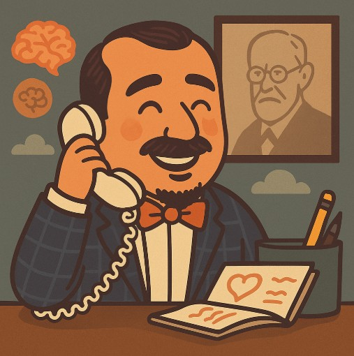

# 🧠 Talk to Slimen

<div align="center">
  
</div>

**Welcome to Talk to Slimen... Your daily companion for mental clarity. This is your safe space.**

Inspired by the beloved character Slimen Labyadh from the iconic Tunisian series "Choufli Hal" 🇹🇳 - now reimagined as your personal psychotherapist companion. Share your thoughts, reflect on your feelings, and find clarity in a familiar, comforting presence.

## 🚀 Talk to Slimen Now

**Ready to chat with Slimen?** Start your conversation right away on Telegram:

<div align="center">
  
👉 **<a href="https://t.me/mindmate007_bot" target="_blank">Talk to Slimen Bot</a>** 👈

**Quick Access QR Code:**


*Scan with your phone's camera to open directly in Telegram*

**🖼️ Enhanced Experience:**
*Don't forget to set the custom wallpaper `@wallpaper.png` in your Telegram chat for the full Slimen experience!*

</div>

Simply click the link above, scan the QR code, or search for `@mindmate007_bot` on Telegram to start your therapeutic journey with Slimen.

## ✨ Features

- **💭 Thought Logging**: Share your thoughts and feelings in a safe, private space
- **🎭 Mood Reflection**: Track and reflect on your emotional state
- **🌱 Calming Resources**: Access supportive content when you need it most
- **🔒 Privacy First**: Your conversations are private and secure
- **📱 Always Available**: 24/7 support whenever you need to talk

## 🛠️ Development Setup

> **⚠️ Important Security Note**: The following setup instructions are for developers who want to create their own "Talk to Slimen" bot instance for development or learning purposes. This will NOT give you access to the official @mindmate007_bot. The official bot is privately owned and operated.

### Prerequisites

- Python 3.13 or higher
- A Telegram Bot Token (from <a href="https://t.me/botfather" target="_blank">@BotFather</a>) - **You must create your own bot**

### Installation

1. **Clone the repository**
   ```bash
   git clone https://github.com/ahmedbellaaj10/mindmate-bot
   cd mindmate-bot
   ```

2. **Install dependencies using uv (recommended)**
   ```bash
   uv sync
   ```
   
   Or using pip:
   ```bash
   pip install -r requirements.txt
   ```

3. **Create your own bot and get a token**
   
   > **Important**: You MUST create your own bot. Do NOT try to use the official MindMate bot token.
   
   - Message <a href="https://t.me/botfather" target="_blank">@BotFather</a> on Telegram
   - Create a new bot with `/newbot`
   - Give your bot a unique name (different from "Talk to Slimen")
   - Copy the token BotFather gives you

4. **Set up environment variables**
   
   Create a `.env` file in the project root:
   ```bash
   BOT_TOKEN=your_own_bot_token_here
   ```

5. **Run your development bot**
   ```bash
   python main.py
   ```

## 📁 Project Structure

```
mindmate-bot/
├── main.py          # Main bot application
├── pyproject.toml   # Project configuration and dependencies
├── uv.lock         # Lock file for dependencies
├── README.md       # This file
├── LICENSE          # Apache 2.0 license
├── .env            # Environment variables (create this)
└── assets/         # Bot assets (profile pic, QR code and wallpaper)
    ├── mindmate-profile.jpg
    ├── mindmate-qr.jpg
    └── wallpaper.png
```

## 🔧 Dependencies

- **python-telegram-bot** (>=22.2): Telegram Bot API wrapper
- **python-dotenv** (>=1.1.1): Environment variable management

## 🤝 Contributing

> **⚠️ Contributor Notice**: Contributing to this repository means contributing to the codebase and features. Contributors do NOT gain access to the official @mindmate007_bot or its administration rights. The official bot remains under the original owner's control.

As this is a mental wellness project inspired by beloved Tunisian culture, contributions are especially welcome! Whether you're:
- Adding new therapeutic features inspired by Slimen's character
- Improving user experience with Tunisian cultural elements
- Enhancing privacy and security
- Adding Arabic/Tunisian dialect support
- Fixing bugs or improving code quality

Feel free to open issues and pull requests. Let's make Slimen the best virtual psychotherapist! 🇹🇳

## 📄 License

This project is licensed under the **Apache License 2.0** - see the [LICENSE](LICENSE) file for details.

**What this means:**
- ✅ You can use, modify, and distribute this code
- ✅ You can use it commercially 
- ✅ You must include the original copyright notice
- ✅ You get patent protection from contributors
- ❗ The official @mindmate007_bot remains under original ownership
- ❗ No warranty or liability - use responsibly for mental health applications

## 🌟 Support

- **Try the bot**: <a href="https://t.me/mindmate007_bot" target="_blank">https://t.me/mindmate007_bot</a>
- **Report issues**: Open a GitHub issue
- **Questions**: Reach out through GitHub discussions

---

## 🎬 About "Choufli Hal"

"Talk to Slimen" is inspired by the iconic Tunisian TV series <a href="https://www.imdb.com/fr/title/tt7151672/" target="_blank">"Choufli Hal" (2005-2009)</a> and its beloved character Slimen Labyadh. The series, rated 9.6/10 on IMDB, is a masterpiece of Tunisian comedy that dealt with daily life, relationships, and social issues with humor and wisdom.

*Remember: While Slimen provides a comforting presence for mental clarity and reflection, this bot is not a replacement for professional mental health care. If you're struggling, please consider reaching out to a mental health professional.*
