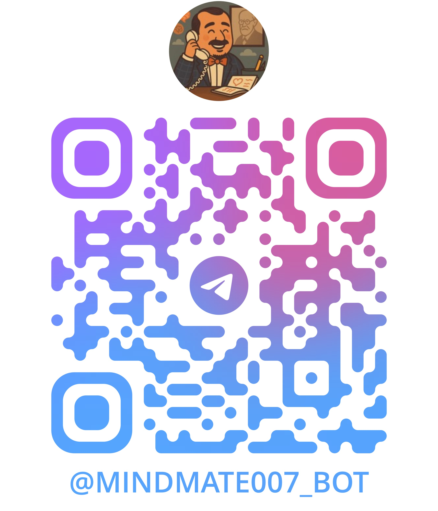

# 🧠 MindMate Bot

<div align="center">
  
</div>

**MindMate — your mental wellness companion.**

Log your thoughts, reflect on your mood, and access calming resources. Private. Supportive. Always here when you need to talk.

## 🚀 Try MindMate Now

**Want to experience MindMate?** You can start chatting with the bot right away on Telegram:

<div align="center">
  
👉 **<a href="https://t.me/mindmate007_bot" target="_blank">Launch MindMate Bot</a>** 👈

**Quick Access QR Code:**



*Scan with your phone's camera to open directly in Telegram*

</div>

Simply click the link above, scan the QR code, or search for `@mindmate007_bot` on Telegram to get started with your mental wellness journey.

## ✨ Features

- **💭 Thought Logging**: Share your thoughts and feelings in a safe, private space
- **🎭 Mood Reflection**: Track and reflect on your emotional state
- **🌱 Calming Resources**: Access supportive content when you need it most
- **🔒 Privacy First**: Your conversations are private and secure
- **📱 Always Available**: 24/7 support whenever you need to talk

## 🛠️ Development Setup

> **⚠️ Important Security Note**: The following setup instructions are for developers who want to create their own MindMate bot instance for development or learning purposes. This will NOT give you access to the official @mindmate007_bot. The official bot is privately owned and operated.

### Prerequisites

- Python 3.13 or higher
- A Telegram Bot Token (from <a href="https://t.me/botfather" target="_blank">@BotFather</a>) - **You must create your own bot**

### Installation

1. **Clone the repository**
   ```bash
   git clone https://github.com/ahmedbellaaj10/mindmate-bot
   cd mindmate-bot
   ```

2. **Install dependencies using uv (recommended)**
   ```bash
   uv sync
   ```
   
   Or using pip:
   ```bash
   pip install -r requirements.txt
   ```

3. **Create your own bot and get a token**
   
   > **Important**: You MUST create your own bot. Do NOT try to use the official MindMate bot token.
   
   - Message <a href="https://t.me/botfather" target="_blank">@BotFather</a> on Telegram
   - Create a new bot with `/newbot`
   - Give your bot a unique name (different from MindMate)
   - Copy the token BotFather gives you

4. **Set up environment variables**
   
   Create a `.env` file in the project root:
   ```bash
   BOT_TOKEN=your_own_bot_token_here
   ```

5. **Run your development bot**
   ```bash
   python main.py
   ```

## 📁 Project Structure

```
mindmate-bot/
├── main.py          # Main bot application
├── pyproject.toml   # Project configuration and dependencies
├── uv.lock         # Lock file for dependencies
├── README.md       # This file
├── LICENSE          # Apache 2.0 license
├── .env            # Environment variables (create this)
└── assets/         # Bot assets (profile pic, QR code)
    ├── mindmate-profile.jpg
    └── mindmate-qr.jpg
```

## 🔧 Dependencies

- **python-telegram-bot** (>=22.2): Telegram Bot API wrapper
- **python-dotenv** (>=1.1.1): Environment variable management

## 🤝 Contributing

> **⚠️ Contributor Notice**: Contributing to this repository means contributing to the codebase and features. Contributors do NOT gain access to the official @mindmate007_bot or its administration rights. The official bot remains under the original owner's control.

As this is a mental wellness project, contributions are especially welcome! Whether you're:
- Adding new wellness features
- Improving user experience
- Enhancing privacy and security
- Fixing bugs or improving code quality

Feel free to open issues and pull requests.

## 📄 License

This project is licensed under the **Apache License 2.0** - see the [LICENSE](LICENSE) file for details.

**What this means:**
- ✅ You can use, modify, and distribute this code
- ✅ You can use it commercially 
- ✅ You must include the original copyright notice
- ✅ You get patent protection from contributors
- ❗ The official @mindmate007_bot remains under original ownership
- ❗ No warranty or liability - use responsibly for mental health applications

## 🌟 Support

- **Try the bot**: <a href="https://t.me/mindmate007_bot" target="_blank">https://t.me/mindmate007_bot</a>
- **Report issues**: Open a GitHub issue
- **Questions**: Reach out through GitHub discussions

---

*Remember: MindMate is designed to provide support and resources, but it's not a replacement for professional mental health care. If you're struggling, please consider reaching out to a mental health professional.*
